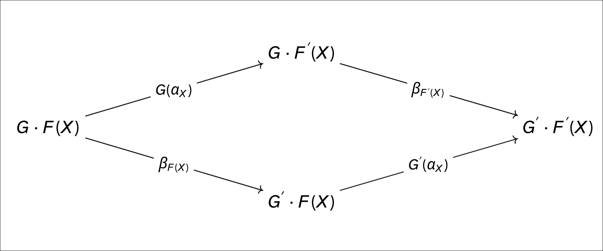
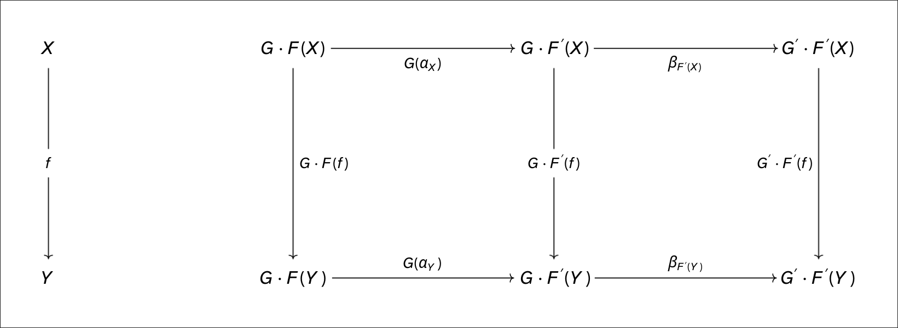
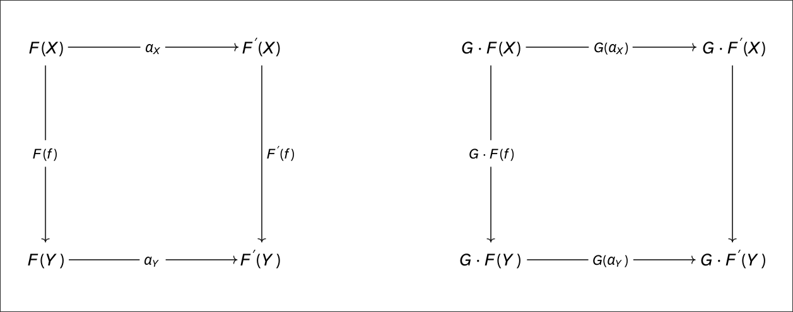

# Natural transformation

## Composition

## Bimap

### Choice of composition

Two options to write the $\alpha$ part needed to be a natural transformation.

[diagram here](https://q.uiver.app/#q=WzAsNCxbMywwLCJHIFxcY2RvdCBGJyAoWCkiXSxbMCwxLCJHIFxcY2RvdCBGIChYKSJdLFs2LDEsIkcnIFxcY2RvdCBGJyAoWCkiXSxbMywyLCJHJyBcXGNkb3QgRiAoWCkiXSxbMSwwLCJHKFxcYWxwaGFfWCkiLDFdLFsxLDMsIlxcYmV0YV97RihYKX0iLDFdLFszLDIsIkcnKFxcYWxwaGFfWCkiLDFdLFswLDIsIlxcYmV0YV97RicoWCl9IiwxXV0=)

The top one was chosen out of convenience.

### Proof for naturality:

The following diagram commutes:

[diagram
here](https://q.uiver.app/#q=WzAsOCxbMywwLCJHIFxcY2RvdCBGIChYKSJdLFszLDMsIkcgXFxjZG90IEYgKFkpIl0sWzAsMCwiWCJdLFswLDMsIlkiXSxbNiwwLCJHIFxcY2RvdCBGJyAoWCkiXSxbOSwwLCJHJyBcXGNkb3QgRicgKFgpIl0sWzYsMywiRyBcXGNkb3QgRicgKFkpIl0sWzksMywiRycgXFxjZG90IEYnIChZKSJdLFswLDEsIkcgXFxjZG90IEYgKGYpIl0sWzIsMywiZiIsMV0sWzAsNCwiRyhcXGFscGhhX1gpIiwyXSxbNCw1LCJcXGJldGFfe0YnIChYKX0iLDJdLFsxLDYsIkcoXFxhbHBoYV9ZKSJdLFs1LDcsIkcnIFxcY2RvdCBGJyAoZikiLDJdLFs2LDcsIlxcYmV0YV97RicgKFkpfSJdLFs0LDYsIkcgXFxjZG90IEYnIChmKSIsMV1d)

The outer part of the rectangle is what we need to commute for naturality.
The proof in the code is just transforming one edge to the other.

To do this we used the naturality of both natural transmutations involved.
One of them had to be first mapped using `G` into `gsq`.
It is simple to see that that the if the first of the following diagrams commutes, then the second
one also commutes.

[diagram](https://q.uiver.app/#q=WzAsOCxbMywwLCJGJyhYKSJdLFswLDAsIkYoWCkiXSxbMCwzLCJGKFkpIl0sWzMsMywiRicoWSkiXSxbNiwwLCJHIFxcY2RvdCBGIChYKSJdLFs5LDAsIkcgXFxjZG90IEYnIChYKSJdLFs5LDMsIkcgXFxjZG90IEYnKFkpIl0sWzYsMywiRyBcXGNkb3QgRihZKSJdLFsxLDAsIlxcYWxwaGFfWCIsMV0sWzAsMywiRicoZikiXSxbMSwyLCJGKGYpIiwxXSxbMiwzLCJcXGFscGhhX1kiLDFdLFs0LDUsIkcoXFxhbHBoYV9YKSIsMV0sWzUsNl0sWzQsNywiRyBcXGNkb3QgRiAoZikiLDFdLFs3LDYsIkcoXFxhbHBoYV9ZKSIsMV1d)
